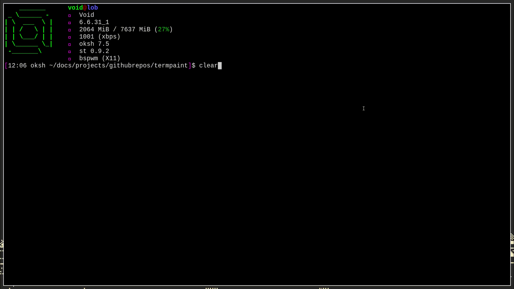

# termpaint
A simple ncurses painting program using ppm\
made for linux\

```sh
./termpaint height width filename
```
| CONTROLS |  |
| :---: | :---:|
| Move | WASD |
| Change color | enter |
| Toggle Drawing mode | space |
| Toggle erase mode | x |
| Quit and export to ppm |

